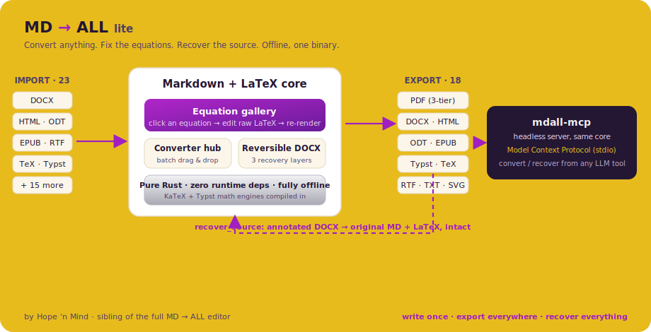
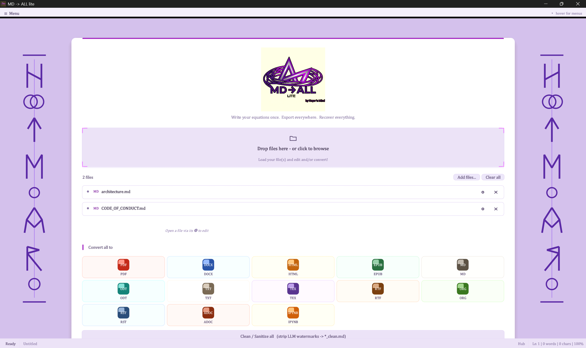
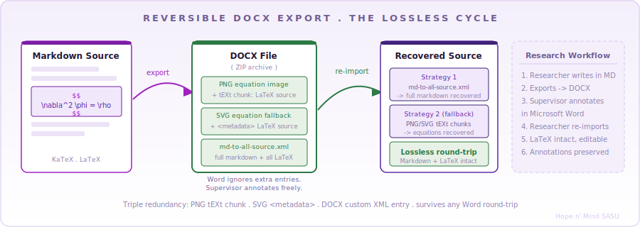
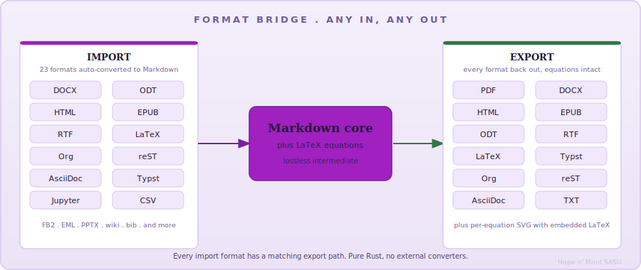

<div align="center">
   ALL lite" width="360"/>
</div>

<br/>

<div align="center">
  <strong>Convert anything. Fix the equations. Recover the source.</strong>
</div>

<br/>

> **MD -> ALL lite** is a focused, self-contained document **converter** with native LaTeX handling, a click-to-edit **equation gallery**, and a headless **MCP server**. No runtime, no install prerequisites, no internet: download one executable, run it, everything works offline.
>
> It is the lightweight sibling of the full [MD -> ALL](https://github.com/hopenmind/mdall) editor. Same lossless conversion core, none of the WYSIWYG weight: open a document, review and correct its equations, and export it anywhere. If you want a full scientific word processor, use MD -> ALL; if you want a fast, dependable converter that never loses your math, use lite.

<br/>

<div align="center">
  
</div>

<br/>

## What it does

- **Converts** between 23 import and 18 export formats, entirely offline, from a batch drag-and-drop **hub**.
- **Preserves your equations.** LaTeX is a first-class citizen end to end, never flattened to an image you cannot get back.
- **Reversible DOCX.** A DOCX exported by lite carries its original Markdown + LaTeX in three redundant layers, so it survives a full Word round-trip and re-imports intact.
- **Equation gallery.** Open a document and every equation is listed as a card with a live preview. Click one, edit the raw LaTeX, and it re-renders in place; the change flows straight into the export.
- **Headless MCP server.** The exact same conversion core, exposed to any LLM tool over the Model Context Protocol, so an agent can convert and recover documents on its own.

<br/>

## Download

Self-contained builds (binaries plus a bundled PDF engine, ready to run):

| Platform | Download |
|---|---|
| Windows x64 | [mdall-win-x64.zip](https://github.com/hopenmind/mdall-lite/releases/latest/download/mdall-win-x64.zip) |
| Linux x64 | [mdall-linux-x64.zip](https://github.com/hopenmind/mdall-lite/releases/latest/download/mdall-linux-x64.zip) |
| macOS (Apple Silicon) | [mdall-macos-arm64.zip](https://github.com/hopenmind/mdall-lite/releases/latest/download/mdall-macos-arm64.zip) |

Just the MCP server (headless converter, no GUI, lighter download):

| Platform | Download |
|---|---|
| Windows x64 | [mdall-mcp-win-x64.zip](https://github.com/hopenmind/mdall-lite/releases/latest/download/mdall-mcp-win-x64.zip) |
| Linux x64 | [mdall-mcp-linux-x64.zip](https://github.com/hopenmind/mdall-lite/releases/latest/download/mdall-mcp-linux-x64.zip) |
| macOS (Apple Silicon) | [mdall-mcp-macos-arm64.zip](https://github.com/hopenmind/mdall-lite/releases/latest/download/mdall-mcp-macos-arm64.zip) |

All versions and changelogs: [github.com/hopenmind/mdall-lite/releases](https://github.com/hopenmind/mdall-lite/releases)

<br/>

## The Converter Hub

<div align="center">
  
  <br/><br/>
  <em>Drop files in, pick a target format, convert. Or open a document straight into its equation gallery.</em>
</div>

<br/>

Drop one file or a hundred onto the hub, choose an output format, and convert. The PDF engine is selectable in-app (a native pure-Rust tier or the higher-fidelity bundled engine). Opening a document takes you to its equation gallery rather than a full editor: lite is built to *convert and correct*, not to author from scratch.

<br/>

## The Equation Gallery

Instead of a full WYSIWYG surface, lite gives you the one editing view a converter actually needs: **every equation in the document, in one place.**

| Action | Result |
|---|---|
| Open a document | Each display equation appears as a card: number, live rendered preview, and its raw LaTeX |
| Click **Edit** on a card | The equation editor opens on that LaTeX, with a live preview |
| Apply | The `$$...$$` block is rewritten in the source and the card re-renders; the fix is in every export from then on |
| Convert | The corrected equations regenerate their PNG / SVG during export automatically |

Text stays as you converted it; you fix the math, then export. For prose editing, that is the full MD -> ALL editor's job.

<br/>

## Reversible DOCX: The Lossless Cycle

<div align="center">
  
</div>

The core innovation: **DOCX export is not destructive.** Every LaTeX equation is preserved in three independent redundant locations inside the file, so the original Markdown + LaTeX can be recovered perfectly after any Word round-trip.

| Layer | Location | Survives |
|---|---|---|
| **Primary** | `md-to-all-source.xml` custom ZIP entry | Word open/save, annotation, track changes |
| **Secondary** | PNG `tEXt` ancillary chunk (`LaTeX: ...`) | Image extraction, copy-paste |
| **Tertiary** | SVG `<metadata>` block | SVG re-use, LibreOffice, older Word |

**Workflow**: convert your paper to DOCX, send it to a supervisor who annotates it in Word, re-import it in lite (or call `recover_source` over MCP), and the original Markdown + every LaTeX equation comes back intact. Each layer is guarded by an end-to-end test, so a build that could silently break recovery never ships.

<br/>

## Formats

<div align="center">
  
</div>

<br/>

| Format | Quality | LaTeX handling | Notes |
|---|---|---|---|
| **PDF** (Tier 1) | best | KaTeX pixel-perfect | Bundled headless rendering engine |
| **PDF** (Tier 2) | high | Typst, New Computer Modern Math | Pure Rust, zero system deps |
| **PDF** (Tier 3) | basic | Unicode approximation | genpdf fallback, always works |
| **HTML** | best | KaTeX, server-side rendered | Self-contained, embedded CSS, offline |
| **DOCX** | high | SVG/PNG equations | **Reversible**, re-importable to Markdown |
| **ODT** | high | PNG equations | LibreOffice compatible |
| **EPUB** | high | PNG equations | E-reader compatible |
| **LaTeX** | best | Native pass-through | `.tex` source, equation-preserving |
| **Typst** | best | Native conversion | Auto-converted LaTeX -> Typst math |
| **RTF / TXT** | basic | Unicode approximation | Word/legacy compatible; plain text always readable |
| **SVG** | best | Vector equations | Per-equation, embeds LaTeX source |

Imports cover `.docx`, `.html`, `.odt`, `.epub`, `.rtf`, `.tex`, `.typ`, `.org`, `.rst`, `.ipynb`, `.md`, and more (23 in all) -- every one converted to Markdown with LaTeX preserved.

<br/>

## LaTeX Support

Lite handles LaTeX in all its real-world forms, as written in actual scientific papers:

```latex
% Display math: all delimiters recognized
$$  \nabla^2 \phi = \frac{\rho}{\varepsilon_0}  $$
\[  \int_0^\infty e^{-x^2}\,dx = \frac{\sqrt{\pi}}{2}  \]

% Inline math
The energy $E = mc^2$ where $m$ is rest mass.

% Environments
\begin{align}
  \dot{x} &= \sigma(y - x) \\
  \dot{y} &= x(\rho - z) - y
\end{align}
```

Double-escaped LaTeX (`\\alpha`), markdown-escaped braces (`\{`), and mixed notation are all normalized automatically before rendering. A malformed delimiter (an unclosed `$$`) is bounded, never allowed to swallow the rest of the document.

<br/>

## MCP Server (`mdall-mcp`)

`mdall-mcp` exposes lite's conversion engine to any client that speaks the [Model Context Protocol](https://modelcontextprotocol.io) over stdio. It runs headless, fully offline, and shares the exact conversion core, including the lossless DOCX round-trip. It is a separate, self-contained binary: use it on its own, with no GUI.

### Configure your MCP client

The server speaks MCP over stdio (newline-delimited JSON-RPC 2.0), so the configuration is just the command. This same `mcpServers` shape works in Claude Desktop, Cursor, Cline, Continue, Windsurf, Zed, and most MCP hosts:

```json
{
  "mcpServers": {
    "mdall": {
      "command": "C:/path/to/mdall-mcp.exe"
    }
  }
}
```

> **Planned:** an opt-in installer option that detects your installed LLM tools and registers `mdall-mcp` into each one's config for you (with a backup first), so you never hand-edit JSON.

### Tools

| Tool | Arguments | Returns |
|---|---|---|
| `list_formats` | (none) | Every import and export format the engine supports. |
| `convert_file` | `{ input, output }` | Converts by file extension. DOCX export stays reversible. |
| `import_to_md` | `{ input }` | Any document returned as Markdown (LaTeX preserved). |
| `export_md` | `{ markdown, output, title?, author?, base_dir? }` | Writes Markdown to a target format; resolves relative images against `base_dir`. |
| `render_equation` | `{ latex, format, scale?, output? }` | Renders a LaTeX equation to PNG/SVG with its source embedded. |
| `recover_source` | `{ input }` | Recovers the original Markdown + LaTeX from a lite-exported DOCX. |
| `inspect_docx` | `{ input }` | Reports whether a DOCX is reversible and how much source it carries. |

Paths are absolute. PDF uses the bundled engine when present and otherwise the pure-Rust Typst tier, so it works with the standalone MCP binary too. Untrusted-input paths are hardened: recovery is panic-guarded, the raster scale is clamped, deep equation XML is depth-bounded, and archive entries are size-capped, so a malformed document degrades to an error rather than taking the server down.

### The reversibility feature

`recover_source` is the differentiator: a DOCX exported by lite embeds its original Markdown + equation LaTeX in three redundant layers, so even after a reviewer annotates it in Word, the exact editable source comes back.

```
author MD  --convert_file-->  paper.docx  --(annotated in Word)-->  paper.docx
                                                                        |
                              recover_source  <------------------------ /
                                    |
                              original Markdown + LaTeX, intact
```

<br/>

## Zero External Dependencies

Lite is fully self-contained. The end user downloads **one file**, runs it, and everything works.

- No VC++ Runtime, no .NET
- No Node.js, no Python, no Pandoc, no LibreOffice
- No external browser to install
- No internet access at runtime

The KaTeX engine (duktape JS), Typst 0.11, and the New Computer Modern Math font are all compiled into the binary. PDF export always falls back to the pure-Rust Typst tier where a bundled engine is unavailable.

<br/>

## Platform Support

| Target | Triple | Status |
|---|---|---|
| Windows x64 | `x86_64-pc-windows-msvc` | Supported, primary |
| Linux x64 | `x86_64-unknown-linux-gnu` | Supported |
| macOS arm64 | `aarch64-apple-darwin` | Supported |

Every target is built natively by CI (`.github/workflows/release.yml`) on GitHub's own runners: push a `vX.Y.Z` tag and the bundles are produced for you.

<br/>

## Build from source

```bash
# Editor + converter + MCP
cargo build --release --bin mdall

# Just the MCP server (headless)
cargo build --release -p mdall-mcp
```

<br/>

## License

(c) 2024-2026 Hope 'n Mind SASU -- contact@hopenmind.com
All rights reserved. Research use permitted with attribution.
See [LICENSE](LICENSE) and [NOTICES.md](NOTICES.md) for full terms and third-party attributions.

> *"Write your equations once. Export everywhere. Recover everything."*

<br/>

<div align="center">
  <sub>A research project by</sub>
  <br/><br/>
  
  <br/>
  <strong>Hope 'n Mind</strong>
</div>
