<p align="center">
  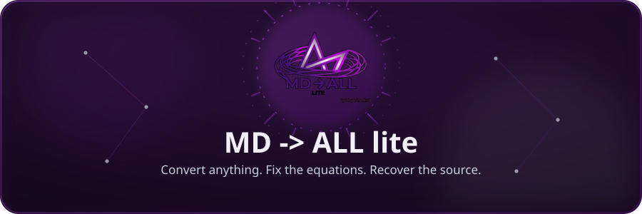 ALL lite">
</p>

<p align="center">
  
  
  
  
  
  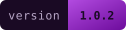
</p>

# MD -> ALL lite

 A focused, self-contained document converter with native LaTeX handling, a click-to-edit equation gallery, and a headless MCP server. Convert between 23 import and 18 export formats, entirely offline, and never lose your math. No experience needed, nothing to set up: one download for Windows, Mac or Linux, no account, no internet. It is the lightweight sibling of the full MD -> ALL editor: same lossless conversion core, none of the WYSIWYG weight.

<p align="center">
  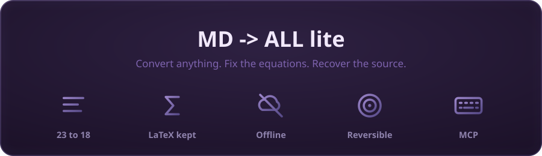 ALL lite does">
</p>

<p align="center">
  <a href="https://github.com/hopenmind/mdall-lite/releases/latest/download/mdall-lite_win-x64.zip"></a>
</p>

<table>
  <tr>
    <td>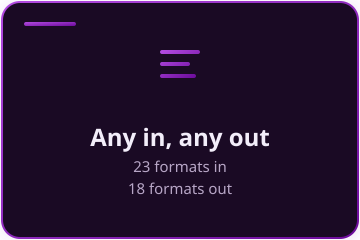</td>
    <td>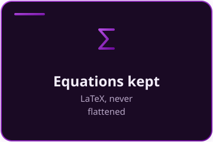</td>
    <td>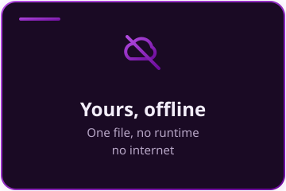</td>
  </tr>
</table>


<a id="convert"></a>


 Copy in, choose a target, convert. 23 import formats to Markdown, 18 export formats back out, from a batch drag-and-drop hub, entirely offline.

<p align="center">
  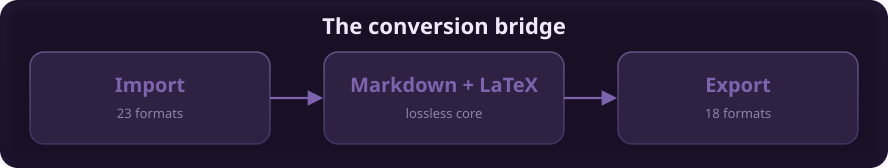
</p>

<p align="center">
  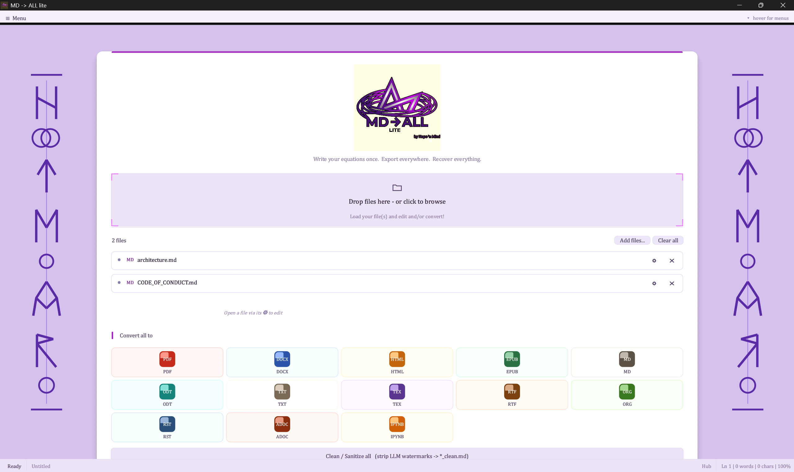
</p>

 **Any in, any out.** Twenty-three import formats become Markdown with LaTeX preserved; eighteen export formats come back out, from one hub.

 **Selectable PDF engine.** A native pure-Rust tier, or a higher-fidelity bundled engine, chosen in the app. Both work with zero system dependencies.

 **Convert, not author.** Opening a document takes you to its equation gallery rather than a full editor: lite is built to convert and correct.


<a id="formats"></a>


 Between 23 import and 18 export formats, each carrying the highest-fidelity LaTeX handling the target allows.

<p align="center">
  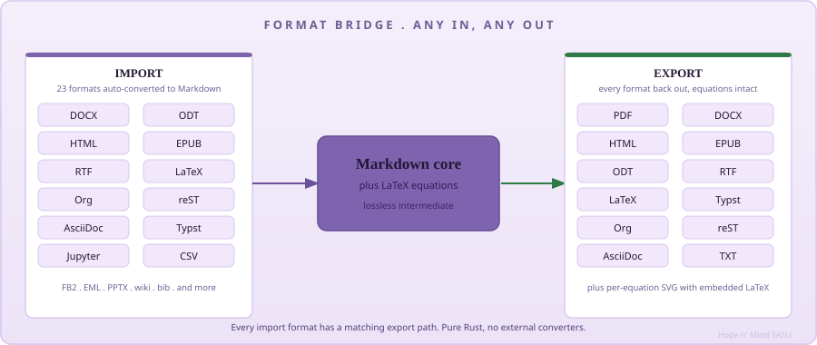
</p>

| Format | Quality | LaTeX handling | Notes |
|---|---|---|---|
| **PDF** (Tier 1) | best | KaTeX pixel-perfect | Bundled headless rendering engine |
| **PDF** (Tier 2) | high | Typst, New Computer Modern Math | Pure Rust, zero system deps |
| **PDF** (Tier 3) | basic | Unicode approximation | genpdf fallback, always works |
| **HTML** | best | KaTeX, server-side rendered | Self-contained, embedded CSS, offline |
| **DOCX** | high | SVG/PNG equations | **Reversible**, re-importable to Markdown |
| **ODT** | high | PNG equations | LibreOffice compatible |
| **EPUB** | high | PNG equations | E-reader compatible |
| **LaTeX** | best | Native pass-through | `.tex` source, equation-preserving |
| **Typst** | best | Native conversion | Auto-converted LaTeX -> Typst math |
| **RTF / TXT** | basic | Unicode approximation | Word/legacy compatible; plain text always readable |
| **SVG** | best | Vector equations | Per-equation, embeds LaTeX source |

Imports cover `.docx`, `.html`, `.odt`, `.epub`, `.rtf`, `.tex`, `.typ`, `.org`, `.rst`, `.ipynb`, `.md`, and more (23 in all) -- every one converted to Markdown with LaTeX preserved.


<a id="equations"></a>


 The one editing view a converter actually needs: every equation in the document, in one place, each a card you can fix in a click.

<p align="center">
  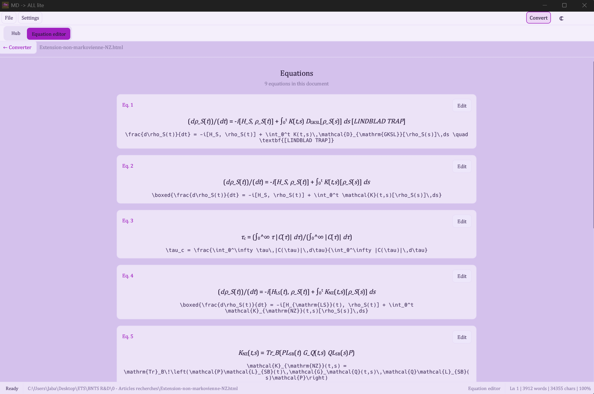
</p>

 **Every equation, one place.** Open a document and each display equation is a card: its number, a live rendered preview, and its raw LaTeX.

 **Click to fix.** Edit the LaTeX, apply, and the block is rewritten in the source; the fix flows into every export from then on.

 **Regenerated on export.** Corrected equations re-render their PNG or SVG automatically during conversion.

| Action | Result |
|---|---|
| Open a document | Each display equation appears as a card: number, live rendered preview, and its raw LaTeX |
| Click **Edit** on a card | The equation editor opens on that LaTeX, with a live preview |
| Apply | The `$$...$$` block is rewritten in the source and the card re-renders; the fix is in every export from then on |
| Convert | The corrected equations regenerate their PNG / SVG during export automatically |


<a id="latex"></a>


 Lite handles LaTeX in all its real-world forms, as written in actual scientific papers.

<p align="center">
  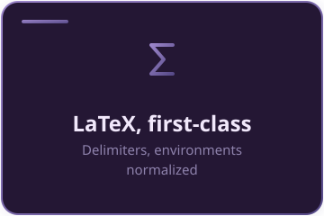
</p>

```latex
% Display math: all delimiters recognized
$$  \nabla^2 \phi = \frac{\rho}{\varepsilon_0}  $$
\[  \int_0^\infty e^{-x^2}\,dx = \frac{\sqrt{\pi}}{2}  \]

% Inline math
The energy $E = mc^2$ where $m$ is rest mass.

% Environments
\begin{align}
  \dot{x} &= \sigma(y - x) \\
  \dot{y} &= x(\rho - z) - y
\end{align}
```

Double-escaped LaTeX (`\\alpha`), markdown-escaped braces (`\{`), and mixed notation are all normalized automatically before rendering. A malformed delimiter (an unclosed `$$`) is bounded, never allowed to swallow the rest of the document.


<a id="reversible"></a>


 The core innovation: DOCX export is not destructive. The original Markdown and LaTeX are recoverable perfectly after any Word round-trip.

<p align="center">
  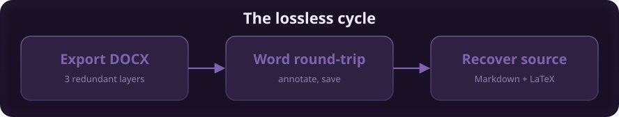
</p>

 **Three redundant layers.** A custom ZIP entry, a PNG tEXt chunk, and an SVG metadata block each carry the original Markdown and LaTeX.

 **Survives Word.** Send a DOCX to a reviewer, let them annotate it in Word, re-import it, and the exact editable source comes back intact.

 **Guarded by tests.** Each layer has an end-to-end test, so a build that could silently break recovery never ships.

| Layer | Location | Survives |
|---|---|---|
| **Primary** | `md-to-all-source.xml` custom ZIP entry | Word open/save, annotation, track changes |
| **Secondary** | PNG `tEXt` ancillary chunk (`LaTeX: ...`) | Image extraction, copy-paste |
| **Tertiary** | SVG `<metadata>` block | SVG re-use, LibreOffice, older Word |

**Workflow**: convert your paper to DOCX, send it to a supervisor who annotates it in Word, re-import it in lite (or call `recover_source` over MCP), and the original Markdown + every LaTeX equation comes back intact. Each layer is guarded by an end-to-end test, so a build that could silently break recovery never ships.


<a id="history"></a>


 A local edit history for your equations: every edit logged locally and timestamped, per document, under your app data folder, with one-click revert to any past version.

<p align="center">
  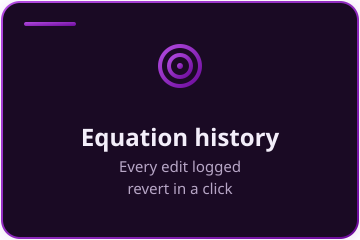
</p>

 **A local, private log.** Every equation edit is recorded under %APPDATA%/MD-ALL/history/, per document. Nothing leaves your machine.

 **Revert in a click.** Expand any equation to see every version and roll back to one; the change rewrites the Markdown source.

 **Exposed over MCP.** equation_history, equation_revert, equation_lint and equation_fix let an agent audit, revert, or auto-fix on its own.


<a id="mcp"></a>


 The exact conversion core, exposed to any LLM tool over the Model Context Protocol, headless and fully offline.

<p align="center">
  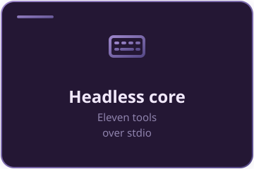
</p>

 **The same core, headless.** mdall-mcp speaks MCP over stdio as a separate, self-contained binary: use it on its own, with no GUI.

 **Hardened for untrusted input.** Recovery is panic-guarded, the raster scale is clamped, equation XML is depth-bounded, and archive entries are size-capped.

### Configure your MCP client

The server speaks MCP over stdio (newline-delimited JSON-RPC 2.0), so the configuration is just the command. This same `mcpServers` shape works in Claude Desktop, Cursor, Cline, Continue, Windsurf, Zed, and most MCP hosts:

```json
{
  "mcpServers": {
    "mdall": {
      "command": "C:/path/to/mdall-mcp.exe"
    }
  }
}
```

> **Planned:** an opt-in installer option that detects your installed LLM tools and registers `mdall-mcp` into each one's config for you (with a backup first), so you never hand-edit JSON.

### Tools

| Tool | Arguments | Returns |
|---|---|---|
| `list_formats` | (none) | Every import and export format the engine supports. |
| `convert_file` | `{ input, output }` | Converts by file extension. DOCX export stays reversible. |
| `import_to_md` | `{ input }` | Any document returned as Markdown (LaTeX preserved). |
| `export_md` | `{ markdown, output, title?, author?, base_dir? }` | Writes Markdown to a target format; resolves relative images against `base_dir`. |
| `render_equation` | `{ latex, format, scale?, output? }` | Renders a LaTeX equation to PNG/SVG with its source embedded. |
| `recover_source` | `{ input }` | Recovers the original Markdown + LaTeX from a lite-exported DOCX. |
| `inspect_docx` | `{ input }` | Reports whether a DOCX is reversible and how much source it carries. |

Paths are absolute. PDF uses the bundled engine when present and otherwise the pure-Rust Typst tier, so it works with the standalone MCP binary too. Untrusted-input paths are hardened: recovery is panic-guarded, the raster scale is clamped, deep equation XML is depth-bounded, and archive entries are size-capped, so a malformed document degrades to an error rather than taking the server down.

### The reversibility feature

`recover_source` is the differentiator: a DOCX exported by lite embeds its original Markdown + equation LaTeX in three redundant layers, so even after a reviewer annotates it in Word, the exact editable source comes back.

```
author MD  --convert_file-->  paper.docx  --(annotated in Word)-->  paper.docx
                                                                        |
                              recover_source  <------------------------ /
                                    |
                              original Markdown + LaTeX, intact
```


<a id="zerodeps"></a>


 Fully self-contained: the end user downloads one file, runs it, and everything works.

<p align="center">
  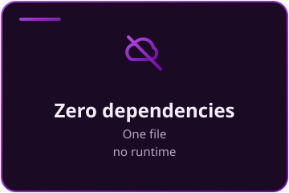
</p>

- No VC++ Runtime, no .NET
- No Node.js, no Python, no Pandoc, no LibreOffice
- No external browser to install
- No internet access at runtime

The KaTeX engine (duktape JS), Typst 0.11, and the New Computer Modern Math font are all compiled into the binary. PDF export always falls back to the pure-Rust Typst tier where a bundled engine is unavailable.


<a id="install"></a>


 Self-contained builds (app, CLI, MCP, and a bundled PDF engine), ready to run. One download, no runtime, no internet. New to GitHub? The download links below are all you need, no account required.

<p align="center">
  <a href="https://github.com/hopenmind/mdall-lite/releases/latest/download/mdall-lite_win-x64.zip"></a>
</p>

| Platform | File |
|---|---|
| Windows x64 (app) | [mdall-lite_win-x64.zip](https://github.com/hopenmind/mdall-lite/releases/latest/download/mdall-lite_win-x64.zip) |
| Windows x64 (installer) | [mdall-lite_win-x64-installer.exe](https://github.com/hopenmind/mdall-lite/releases/latest/download/mdall-lite_win-x64-installer.exe) |
| Linux x64 (app) | [mdall-lite_linux-x64.zip](https://github.com/hopenmind/mdall-lite/releases/latest/download/mdall-lite_linux-x64.zip) |
| macOS arm64 (app) | [mdall-lite_macos-arm64.zip](https://github.com/hopenmind/mdall-lite/releases/latest/download/mdall-lite_macos-arm64.zip) |
| Windows x64 (MCP only) | [mdall-lite_mcp-win-x64.zip](https://github.com/hopenmind/mdall-lite/releases/latest/download/mdall-lite_mcp-win-x64.zip) |
| Linux x64 (MCP only) | [mdall-lite_mcp-linux-x64.zip](https://github.com/hopenmind/mdall-lite/releases/latest/download/mdall-lite_mcp-linux-x64.zip) |
| macOS arm64 (MCP only) | [mdall-lite_mcp-macos-arm64.zip](https://github.com/hopenmind/mdall-lite/releases/latest/download/mdall-lite_mcp-macos-arm64.zip) |

**Build from source**

```bash
# The lite app (converter + equation gallery)
cargo build --release --bin mdall-lite

# Just the MCP server (headless)
cargo build --release -p mdall-mcp
```

**Platform support**

| Target | Triple | Status |
|---|---|---|
| Windows x64 | `x86_64-pc-windows-msvc` | Supported, primary |
| Linux x64 | `x86_64-unknown-linux-gnu` | Supported |
| macOS arm64 | `aarch64-apple-darwin` | Supported |

Every target is built natively by CI (`.github/workflows/release.yml`) on GitHub's own runners: push a `vX.Y.Z` tag and the bundles are produced for you.


<a id="limitations"></a>


 **Convert, not author.** Lite opens a document into its equation gallery, not a full editor. For prose editing, use the full MD -> ALL.

 **PDF fidelity is tiered.** The bundled engine is pixel-perfect; the pure-Rust Typst tier is high; the genpdf fallback is a basic Unicode approximation.

 **Reversibility is a lite-DOCX feature.** Perfect recovery applies to a DOCX that lite exported; a DOCX from another tool imports as Markdown without the redundant source layers.


<p align="center">[License](LICENSE) &nbsp;&middot;&nbsp; [Notices](NOTICES.md)</p>

<p align="center"><sub>(c) 2024-2026 Hope 'n Mind SASU. All rights reserved. Research use permitted with attribution.</sub></p>

<br>

<p align="center"><sub>MD -> ALL lite is published by <b>Hope 'n Mind SASU</b></sub></p>
<p align="center"></p>
<p align="center"><sub>SIREN 938 261 310 &middot; RCS Brest &middot; contact@hopenmind.com &middot; hopenmind.com</sub></p>

<p align="center"><em>Write your equations once. Export everywhere. Recover everything.</em></p>
